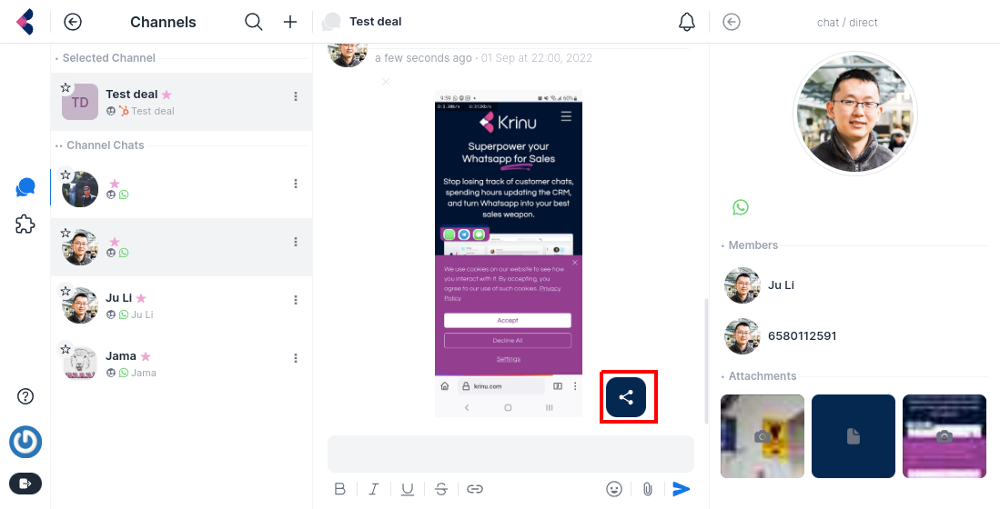

# Logging Attachments

## Basic Usage 

By default, attachments in Krinu are not automatically logged in HubSpot.

To log your attachments, simply click on the share button on the file.

## Limits

1. Hubspot attachments are limited to 100MB

