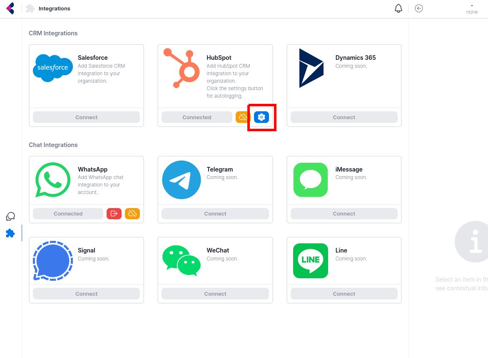

import Image from 'next/image'

# Automatically Log Messages

## Basic Usage 

By default, messages in Krinu are not automatically logged in your CRM. 

To automatically log your messages, visit the [Integrations Page](https://app.krinu.com/integrations) and click on the blue gear icon next to your connected CRM.

## Logging behavior

Messages are logged automatically at midnight PST.

|  Object | Type of object logged  |  Type of messages logged |
|---|---|---|
| Deals/Opportunities | Deals/opportunites that have been used to create channels | Messages in chats added to the created channels  |
| Companies/Accounts  | Companies/accounts associated with deals/opportunites used to create channels  | Messages in chats added to the created channels |
| Contacts  | Contacts with phone number/mobile number matching messaging account number  | All messages in all chats |

## Limitations

1. Attachments are not logged.
2. Autologging isn't an organization-wide setting. Each user has to turn it on individually.
