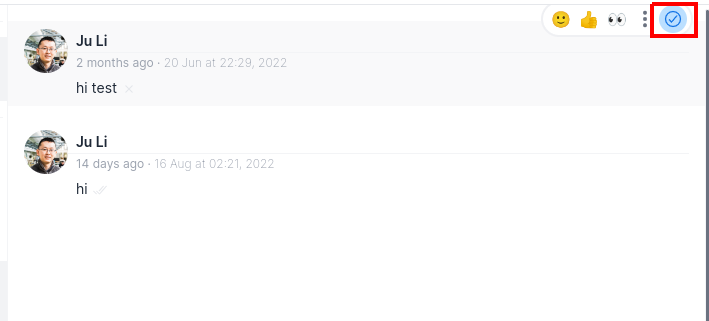

# Logging Messages

## Basic Usage 

By default, chat messages in Krinu are not automatically logged in your CRM. 

To log your chat messages, simply hover over each message and click on the checkmark to select the message.

Once you are done selecting the messages you wish to log, click on the share button and click `Add to Timeline`.

You will now be able to see the logged messages on your opportunity/deal.

## Viewing on HubSpot Timeline

Chat messages logged to your Hubspot timeline will not automatically show up in your Hubspot timeline. To show logged messages, click on `Filter Activity` on your Hubspot timeline

Then make sure that Krinu is checked under Integrations

