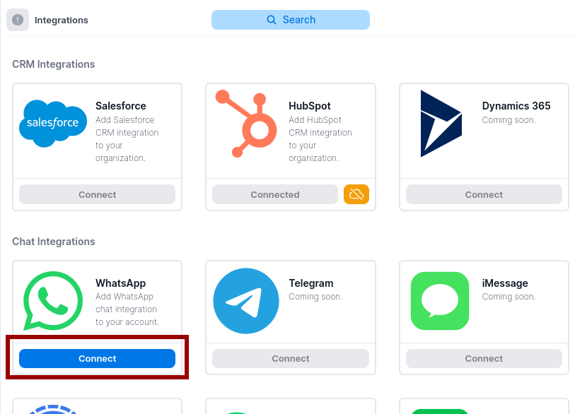

import Image from 'next/image'

# Get Started

## Sign In With Your CRM

On the login page, pick your CRM to sign in with

Once you have granted access, our app will pull and sync the following data:
1. Accounts, contacts, and opportunities 
2. That are owned by you into our system
3. And, have been created/modified in the last 30 days
To request more data to be synced, please contact support [here](/).

## Connect Your Messaging App

1. Click on your profile and click on "Integrations"

2. Click "Connect" on a messaging app

3. Open your messaging app and scan the QR code

4. To disconnect your messaging app, click on the red exit button

**Notes**: 
- Messages that you send on Krinu while disconnected will be queued for send. They will be sent immediately after reconnecting.
- Disconnecting your app does not delete your messaging data from our servers. To request full data deletion, please contact support [here](/).

## Select Your CRM Opportunities

Messaging chats in Krinu are organized around opportunities (also known as Deals in Hubspot)

To select opportunities, first click on Chat, followed by the opportunity in the list.

<Image src="/screenshots/select-opp-1.png" alt="Select Opps" width={346} height={449}/>

## Select Your Chats

Click on the pink plus button and it will popup a list of chats

### Add existing chats

The popup lists chats that already exist on your phone. Select them to attach them to the opportunity. Deselect them to remove them from the opportunity.

**Note**: Only attached chats will be synced to your CRM.

### Start new direct chat

Click on `New Direct` to start a new direct chat with a contact. 

**Note**: Only contacts associated with the CRM opportunity can be added.

