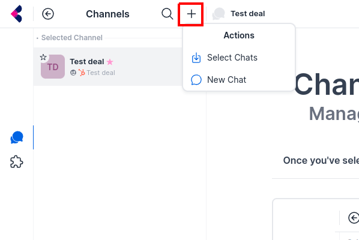

import Image from 'next/image'

# Get Started

## Sign In With Your Hubspot Account

On the login page, click the Hubspot button to sign in with

Once you have granted access, our app will pull and sync the following data:
1. Accounts, contacts, and open opportunities 
2. That are owned by you into our system
3. And, have been created/modified in the last 30 days
To request more data to be synced, please contact support [here](/).

## Connect Your Messaging App

1. Click on the Integration icon on the left sidebar

2. Click "Connect" on a messaging app

3. Open your messaging app and scan the QR code

4. To disconnect your messaging app, click on the red exit button

**Notes**: 
- Messages that you send on Krinu while disconnected will be queued for send. They will be sent immediately after reconnecting.
- Disconnecting your app does not delete your messaging data from our servers. To request full data deletion, please contact support [here](/).

## Create Channels

Messaging chats in Krinu are organized around channels. 

Currently, channels can be created from Hubspot Deals/Salesforce Opportunities. In the future, channels can be created from Companies/Accounts. 

To select a Hubspot Deal/Salesforce Opportunity, first click on the Add button, and click on `New Channel`

<Image src="/screenshots/add-channel-1.png" alt="Select Channel" width={554} height={330}/>

Select a deal/opportunity and click Save.

## Add Chats to A Channel

Select a channel and click on the Add button. It will now let you add an existing chat or create a new chat.

### Add existing chats

Clicking `Select Chats` will list chats that already exist on your phone. Select them to attach them to the channel. Deselect them to remove them from the channel.

**Note**: Only attached chats will be synced to your CRM.

### Start new direct chat

Clicking on `New Chat` will list contacts you can start a new chat with.

**Note**: Only contacts associated with the channel's CRM opportunity/deal can be added.

