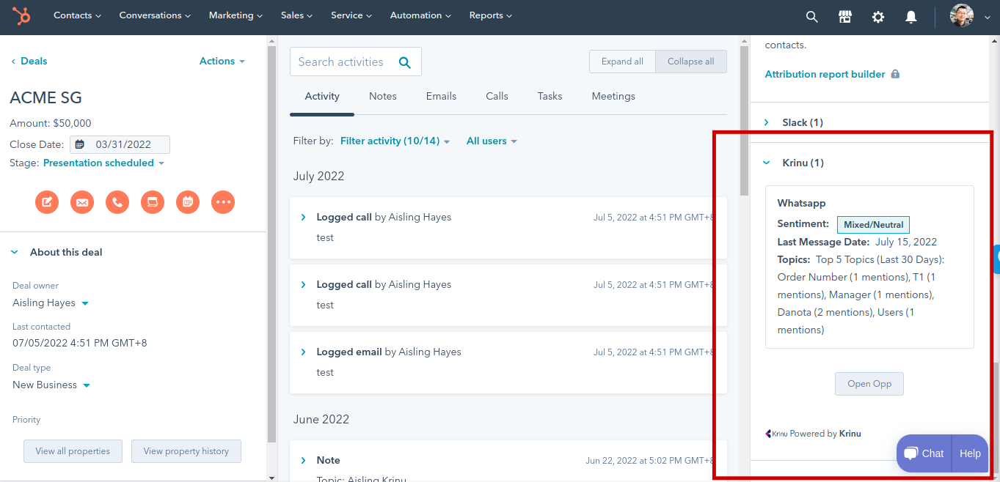

import Image from 'next/image'

import gif1 from '../../public/screenshots/crmcard-2.gif'
import gif2 from '../../public/screenshots/crmcard-3.gif'

# CRM Card

## Introduction 

You can open Krinu and chat with your contacts directly from Hubspot! 

Our integration adds a card to the contacts and deals in Hubspot. The card can be located at the bottom of the right sidebar. See:

We recommend moving the card up the right sidebar so that it is more accessible. You can do it like this: 

<Image src={gif1} alt="Relocate CRM Card" width={600} height={497}/>

Click on `Open Opp` or `Open Contact` to chat with your contact

<Image src={gif2} alt="Open Chat" width={600} height={338}/>

## Limitations

1. Metrics are computed and refreshed hourly so newly added deals and contacts will not show
2. Does not work on Firefox
3. Contacts must have a phone number

If there are any issues, please contact support [here](/).